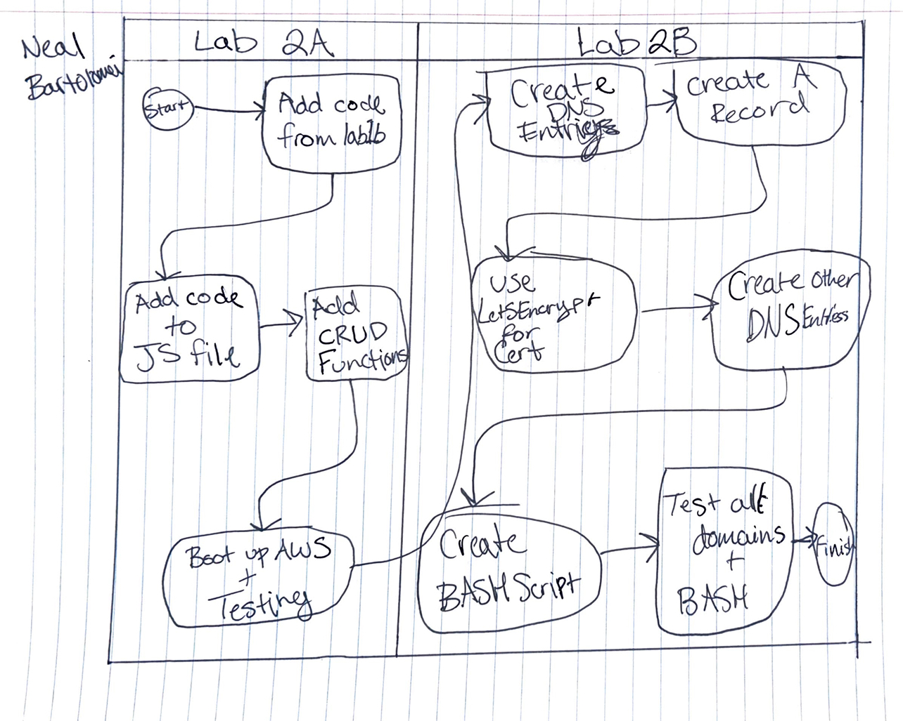
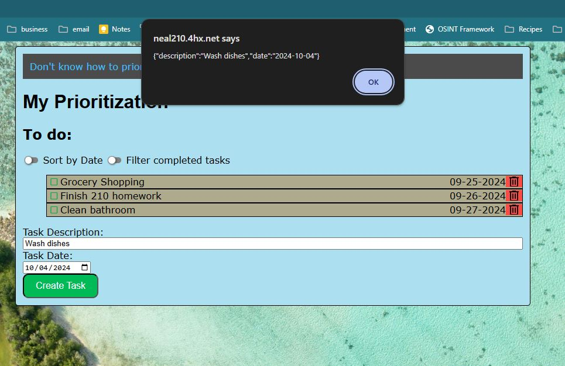
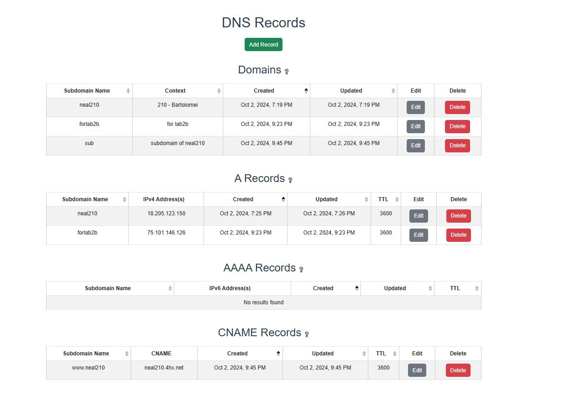
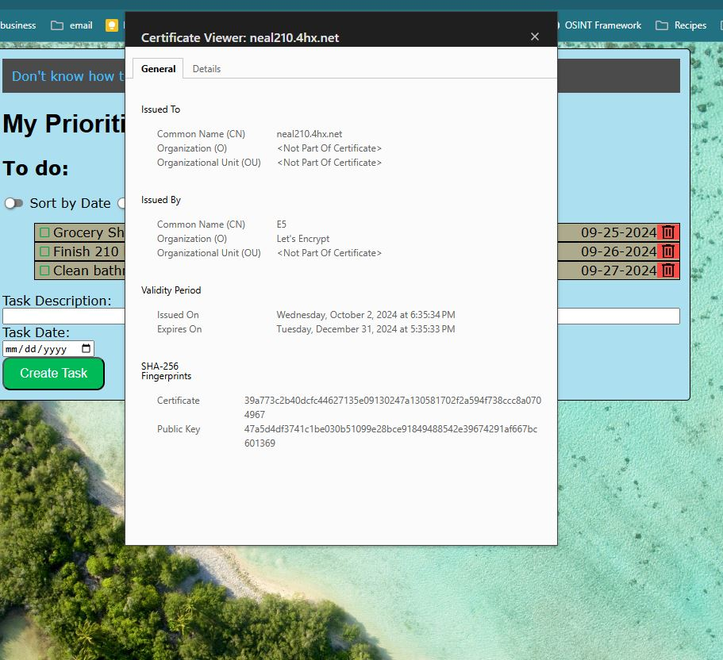

## Introduction
Neal Bartolomei
3 October 2024
Lab 2: JavaScript, DNS, and HTTPS

## Executive Summary

JavaScript was used in this lab to add functionality to a website that creates tasks. It was also employed to implement local storage in the browser. Additionally, HTTPS was enabled, and a DNS entry for a server was set up.

## Design Overflow

The UML diagram illustrates the processes carried out in Lab 2. Each swimlane represents parts 1 and 2 of the lab, detailing the actions taken in each section.

### Lab 2 Design Overflow

As shown in the UML, the user impliments the use of JavaScript, DNS entries, and HTTPS. Part 1 (Javascript) of the lab creates website functionality and Part 2 (DNS and HTTPS) adds a domain and a certificate to the website.

The screenshots below show Functionality, Domains, and the Certificate.

### Fuctionality

### Domains and A Record

### Certificate

### File Descriptions

* src/index.html - HTML file used for the webpage
* src/js/script.js - Adds functionality to the webpage
* src/css/style.css - Adds custom styles to the webpage
* setup_server.sh - Bash script file -> Automate Server Startup

## Questions:

1. What are two differences and similarities between JavaScript and a previous language you have used (e.g. C++ or Python)? (Think of differences and similarities that are more unique to these 2 languages, not all languages in general.)

JavaScript is an object-oriented language and supports classes and class hierarchies. However, it is specifically designed for web development. Moreover, JavaScript allows implicit data type conversions, unlike some other languages.

2. What is the difference between JSON and JavaScript objects?

JSON cannot contain functions.

3. If you open your web page in two different browsers, will changes on one appear on the other? Why or why not?

Changes will only appear in the browser where they were made. Each browser functions independently and maintains its own local version of the website's state.

4. How long did you spend on this lab?

Part 1 of Lab 2 took around 3 hours and part 2 a little bit longer I would say.

5. What is the difference between http and https?

HTTP is a protocol for network communication, however, when a website displays HTTPS - the server and browser have established a secure connection before data transfer started.

6. What does the A record do in your DNS domain?

The A record is used to map a domain to a specific IP Address.

7. Which key does the `certbot` tool send to Let's Encrypt to be embedded in the certificate; the public key or the private key?

The public key is embedded in the certificate.

8. What is the TTL setting in DNS, what are the units, and what does it do?

The Time to Live setting is in seconds and tells the DNS resolver how long to cache a query before performing a new lookup.

9. The DNS registrar tool is new this year. What did you like about it? What could we do to improve it?

I found the DNS registrar tool to be user-friendly and easy to navigate. I do not think there are any major improvements needed, but adding some visual elements could make it look nicer.

10. How would you incorporate bash scripts in your future?

The setup_server.sh bash script can be used to quickly startup the server in future labs. I will also try to see if I can use this method to assist me in any other classes in the future (I can also use this at work for what I do with my powershell commands working with Active Directory syncs, etc.)

## Lessons Learned:

While developing the JavaScript file for the website, all text in the task description became left-aligned. It was discovered that a div container had been deleted in the HTML file but not in the JavaScript file, causing JavaScript to reference a nonexistent container. After removing the div container from the JavaScript file, the website's structure returned to normal.

When testing the alias domain, the certificate was not verified. Upon inspecting the Apache server configuration, it turned out that the correct config file mapped to the main domain was missing from the /sites-available directory. After correcting the file in /sites-available, the certificate worked on the alias domain.

When creating the bash script for automatic server startup, an error occurred when attempting to update the Apache server. Upon reviewing the bash script, it was found that there was incorrect command ordering. Once I fixed the command sequence, the script ran without errors.

## Conclusions

- Use JavaScript to add functions to webpage
- Assign a webpage a domain
- Create a certificate for a website
- Map one domain to another

## References

https://ryanstutorials.net/bash-scripting-tutorial/bash-script.php
https://certbot.eff.org/
https://developer.mozilla.org/en-US/docs/Learn/JavaScript/Objects/JSON
https://www.cloudflare.com/learning/dns/what-is-dns/