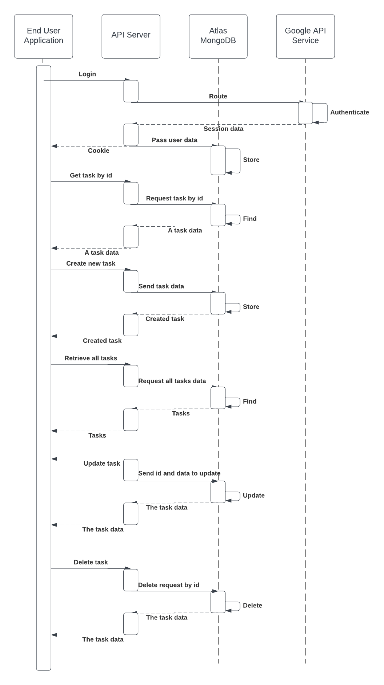
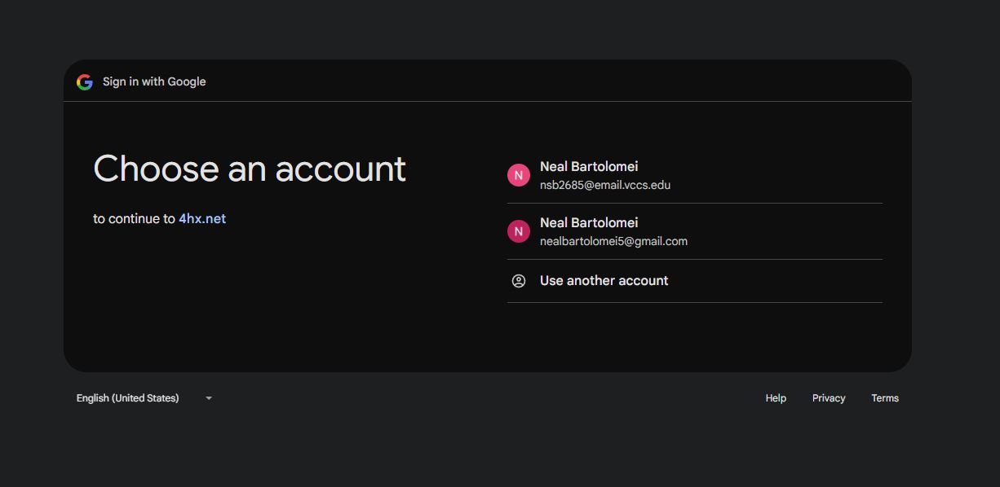
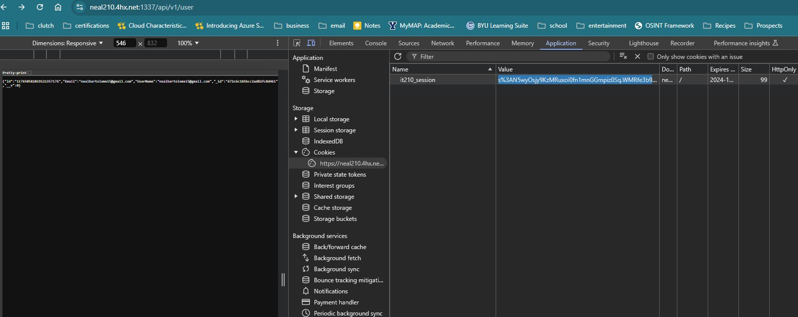

# Lab4 Writeup
Neal Bartolomei
11-7-2024

## Executive Summary
This lab focused on building a RESTful API with Node.js, utilizing Express middleware to manage user tasks with full CRUD operations through MongoDB. Google API services were incorporated to streamline user authentication. This project was instrumental in honing backend development skills, specifically in crafting reliable APIs, handling NoSQL databases, and leveraging Google services for added functionality.

## Design Overview
The technical design centers around a RESTful API built with Node.js, serving as an interface between client requests and a MongoDB database that stores user tasks. Adhering to REST principles, this API facilitates Create, Read, Update, and Delete (CRUD) operations, allowing smooth task management.

Express and its middleware formed the backbone of the API, offering a streamlined framework for server-side code. Middleware provided additional functionality, such as request parsing and logging, optimizing the request-response cycle. For authentication, the Google API service was employed to simplify secure login processes, while MongoDB handled data with flexible querying capabilities, meeting scalability needs.

### UML Diagram

### Screenshots
#### Login Page:

#### Session Cookie:

### Created/Modified files
#### app/index.js
The primary file that initializes the API, `index.js`, sets up middleware and routing necessary for proper functionality. It imports essential packages like express, cookie parsers, session management tools, and database connectors. Specific routes are designated for handling user authentication, tasks, and sessions, which keeps the code modular. For session management, cookies are configured securely, particularly in production environments.

#### mongoose.js
The `mongoose.js` file is designed to handle the MongoDB database connection. It uses the connect method from the 'mongoose' package and retrieves the connection string from environment variables. Successful connections or errors are logged in the console to confirm stability.

#### passport.js
This file manages user sessions and authentication, utilizing Passport middleware for Node.js and Google OAuth for secure logins. It establishes a connection with Google using OAuth credentials stored in environment variables and includes a utility function to retrieve or create a user in MongoDB.  
Session storage is initialized in MongoDB via MongoDbStore, with session-related actions logged for monitoring.

#### Task.js
The file `Task.js` file defines the structure of task entries stored in MongoDB.
 
This setup uses Mongoose as an Object Data Modeling (ODM) library, simplifying interactions with MongoDB.
 
The next section defines a schema for the tasks using mongoose. This 'TaskSchema' specifies what kind of data each task will contain. Here, each task has four properties:
1. 'UserId' (type: String) - the user ID associated with the task.
2. 'Text' (type: String) - the task description.
3. 'Done' (type: Boolean) - indicates task completion, defaulting to 'false' if not specified.
4. 'Date' (type: String) - the date associated with the task.

 
After defining the schema, a Mongoose model named 'Task' is created, which is then exported for use in other parts of the application.

#### User.js
This file defines and manages the structure for user data stored in MongoDB.
 
After importing Mongoose, the file outlines the UserSchema, which includes:
1. Id (type: String)
2. Email (type: String)
3. UserName (type: String)

 
Once defined, the 'User' model is created based on this schema and exported for use across the application, enabling user data management.
 

#### auth.js
The `auth.js` file implements user authentication functions. When users attempt to log in, they are redirected to Google’s sign-in page via the '/google' GET route. Upon successful login, they return to the application via the '/google/callback' route.
 
In the /google/callback route, user sessions are managed, with errors logged and a 500 status returned if issues occur.
 
The /logout route manages user logout requests, destroying sessions and redirecting users to the location set by the 'CLIENT_ORIGIN' environment variable.

#### tasks.js
This file defines routes for CRUD operations on task entries, enabling interaction with MongoDB through specific HTTP methods:
1. `router.get('/:id')` - Retrieves a task by ID. Returns 404 if the task is not found.
2. `router.post('/')` - Creates a new task using data from the request body and saves it.
3. `router.get('/')` - Returns all tasks for a specific user, filtered by user ID.
4. `router.put('/:id')` - Updates a task by ID with new details from the request body.
5. `router.delete('/:id')` - Deletes a task by ID and returns a confirmation message upon success.

#### user.js
This file provides an endpoint that retrieves details of the authenticated user. Upon a GET request to '/', it returns user information from the request object (req.user). Successful operations return a status of 200; otherwise, a 500 status is sent if errors occur.

## Questions
### Name and discuss at least two of the benefits of writing unit tests before writing code.
Writing tests before coding lets developers concentrate on expected outcomes and requirements. It also helps ensure that edge cases are covered, reducing potential bugs. With pre-written tests, adding new features becomes easier, as developers can immediately observe the impact of changes.
 
Starting with tests also pushes developers to consider API design from the user’s perspective, often leading to simpler, modular, and user-friendly APIs.

### What would be some of the benefits of automating your test scripts (i.e. so they run at each commit)?
Automated testing provides consistent, rapid test execution without extra costs, improving software quality and reducing time spent on repetitive tests. Automated tests allow complex, unattended checks across configurations and in-depth analysis, achieving broader coverage than manual testing.
 
Automated testing also reduces human error, producing precise results and freeing testers to focus on developing new tests or tackling complex features.

### How long did this lab (lab4a) take you?
Lab 4a took about 5 hours, while lab 4b took around 12.

### List three advantages to using a web API.
1. Simple setup and easy to define in a RESTful format.
2. Operates over HTTP, which is efficient for defining and exposing endpoints.
3. Lightweight, making it ideal for devices with limited bandwidth, like smartphones.

### What are the differences between these four HTTP methods: GET, POST, PUT, and DELETE? Which ones are idempotent?
GET - Retrieves data from the server; idempotent, meaning multiple identical requests return the same result. 
POST - Sends data to create a new resource; not idempotent, as repeated requests may create multiple resources. 
PUT - Updates an existing resource or creates it if absent; idempotent, with repeated requests having the same effect. 
DELETE - Removes a specific resource; idempotent, as repeated calls yield the same result 

## Lessons Learned
1. Deploying to a live server encountered syntax issues with MongoDB files. Relocating the project to a different directory resolved the issue, allowing the project to run successfully on the domain. Specifically moving it to the home folder within my web server.
2. During DELETE testing, a 404 error was expected but not returned. Investigating with Postman revealed the response status was incorrect, prompting a fix to align error handling.
3. Capitalization inconsistencies between variable names caused test failures. Standardizing the naming resolved these issues, leading to successful test passes.

## Conclusions
* Set up and configured MongoDB
* Tested API endpoints using Postman
* Created MongoDB modules for structured data handling
* Integrated Google authentication
* Implemented CRUD operations on a NoSQL database using JavaScript

## References
<em>REST API Tutorial</em>
* https://restfulapi.net

<em>The Art of Test-Driven Development: A Comprehensive Guide</em>
* https://dev.to/easewithtuts/the-art-of-test-driven-development-a-comprehensive-guide-gbl

<em>Top 19 Benefits Of Automation Testing For Web And Mobile Apps In 2024</em>
* https://www.lambdatest.com/blog/benefits-of-automation-testing