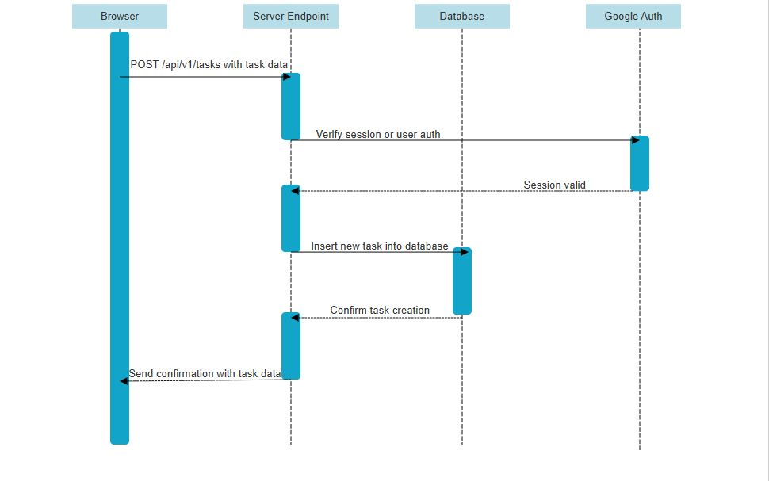
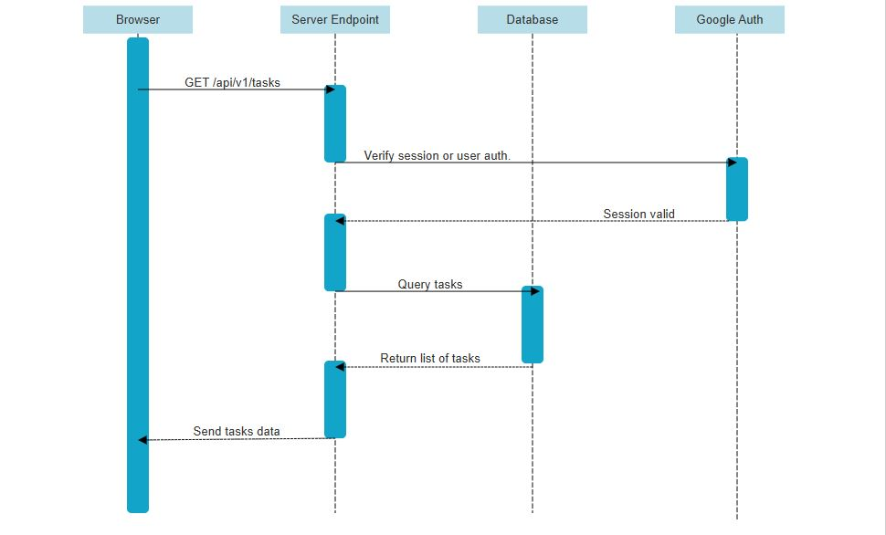
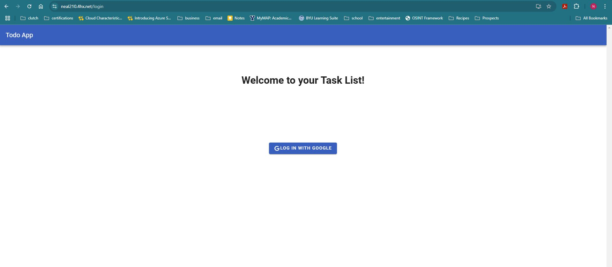
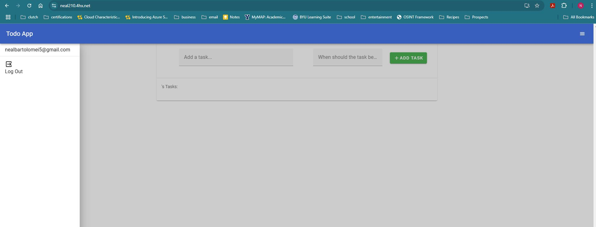

# Creating ToDo App with Vue.js and Node.js
Neal Bartolomei  
IT&C 210B
12-08-2024

## Executive Summary  
This project involved building a full-stack web application with a `Vue.js` front end communicating with a RESTful `Node.js` API backend. The backend manages user tasks with full CRUD operations stored in MongoDB. Google API services were integrated for secure authentication. The `Vue.js` front end provides an intuitive interface for managing tasks. This project strengthened skills in frontend frameworks, backend services, and integrating third-party APIs.

## Design Overview  
The application consists of a `Vue.js`-based single-page front end and a RESTful backend powered by `Node.js` and Express. The backend uses MongoDB for data persistence and `Passport.js` for Google OAuth authentication. The front end communicates with the API to manage tasks, allowing users to create, update, and delete tasks in real-time.  

### User Interaction Flow  
1. Users log in via Google OAuth, which redirects them to the backend for authentication.  
2. Once authenticated, the front end fetches user-specific tasks from the `/api/v1/tasks` endpoint.  
3. Users can:  
   - Add tasks using the form in the `NewTaskForm` component.  
   - Update task statuses directly in the `TaskList` component.  
   - Delete tasks, triggering the corresponding API endpoint.  
4. All updates are displayed dynamically without requiring a page refresh.

## UML Diagrams
### Create New Tasks 

### View Existing Tasks

### Screenshots  
#### Login Page:  
  

#### Task Management:  
  

### Created/Modified Files:
- **`App.vue`:** The main entry point of the Vue application. Manages the layout and navigation bar that appears on every page.
- **`components`:**
  - **`AppBar.vue`:** Contains the navigation bar with login/logout functionality.
  - **`NewTaskForm.vue`:** Handles creating new tasks.
  - **`TaskList.vue`:** Displays a list of tasks and allows updates or deletions.
    - **Explanation:** These methods emit events to the parent component, which handles the actual task deletion or update logic. This maintains separation of concerns.
    - **Code:**
      methods: {
        deleteTask(task) {
          this.$emit("deleteTask", task);
        },
        updateTask(task) {
          this.$emit("updateTask", task);
        },
      }

- **`router/index.js`**: Manages client-side routing, including authentication checks.
  - **Explanation:** The checkAuth function ensures that only authenticated users can access the home page. If authentication fails, the user is redirected to the login page.
  - **Code:**
    const checkAuth = async (to, from, next) => {
      try {
        if (await authenticated()) next()
        else next({ path: '/login', replace: true });
      } catch (error) {
        console.error(error.message);
        next({ path: '/login', replace: true });
      }
    };

    const routes = [
      {
        path: '/',
        name: 'Home',
        component: Home,
        beforeEnter: checkAuth,
        props: true
      },
      {
        path: '/login',
        name: 'Login',
        component: Login,
      }
    ];

- **`views/`**:
  - **`Home.vue`**: This method retrieves all tasks for the authenticated user from the backend and stores them in the `tasks` array for rendering.
    - **Explanation:** This method retrieves all tasks for the authenticated user from the backend and stores them in the `tasks` array for rendering.
    - **Code:**
      readTasks() {
        fetch(`${process.env.VUE_APP_API_ORIGIN}/api/v1/tasks`, {
          method: 'GET',
          credentials: 'include',
        })
          .then(response => response.json())
          .then(data => {
            console.log(data);
            this.tasks = data;
            this.fetched = true;
          });
      }

  - **`Login.vue`**: Login page, redirects users to Google OAuth.
- **`util/index.js`**: Contains utility functions such as authentication checks and cookie management.
  - **Explanation:** This function checks whether the user is authenticated by sending a `GET` request to the backend /api/v1/user endpoint. It returns a promise that resolves to true or false based on the backend response.
  - **Code:**
    export const authenticated = () => new Promise(resolve => {
      fetch(`${process.env.VUE_APP_API_ORIGIN}/api/v1/user`, { credentials: 'include' })
        .then(({ ok }) => resolve(ok))
        .catch(err => {
          console.error(`Error in 'authenticated': `, err)
          resolve(false)
        })
    });

- **`app/index.js`**: Initializes the API, middleware, and routes for the application.
- **`models/`**:
  - **`Task.js`**: Defines the structure for task data in MongoDB.
  - **`User.js`**: Defines the structure for user data in MongoDB.
- **`routes/`**:
  - **`auth.js`**: Manages authentication routes (login, logout).
  - **`tasks.js`**: Handles CRUD operations for tasks.
  - **`user.js`**: Retrieves authenticated user information.

## Questions  
### Why use Vue over other web frameworks that you have experience with?
1. Vue.js is easy to learn and use due to its clean and intuitive syntax. It strikes a balance between simplicity and capability, providing robust features without the complexity of frameworks like Angular. Its component-based architecture simplifies application development and maintenance, while its reactive data binding ensures a dynamic user experience with less boilerplate. Vue’s flexibility to scale from small to large projects and its comprehensive ecosystem (e.g., Vue Router, Vuex) make it a versatile choice for web development.

### Explain a situation where it would make sense to use a computed property instead of a property in the data object.
1. Computed properties are ideal when a value depends on other reactive properties and needs to be dynamically derived. For example, if you are building a task tracker and want to show the number of completed tasks, you can use a computed property to filter the task list and count only the completed ones. This ensures the count is automatically updated whenever the tasks change, without requiring redundant logic or manual updates.

### Why are Vue projects called "single-page applications"? What does that mean?
1. Vue projects are called single-page applications (SPAs) because they operate within a single HTML page, dynamically updating content without requiring a full page reload. Instead of traditional server-rendered navigation, SPAs use JavaScript to load new content and update the view dynamically. This results in faster transitions, a smoother user experience, and more efficient resource usage by reducing server-side rendering overhead.

### How long did this project take you?  
Lab 5A took approximately 12 hours, while Lab 5B required 8 hours, including deployment.  

## Tips and Warnings

1. **Tip**: Ensure your `.env` files are correctly configured for both front-end and back-end, especially for `CLIENT_ORIGIN` and `VUE_APP_API_ORIGIN` variables.
2. **Tip**: Use `pm2` to manage the back-end server for stability in production. This made it way easier to get everything running in the terminal.
3. **Warning**: Permissions issues can arise when building the front-end. Ensure proper ownership and permissions for the `dist/` directory.

## Lessons Learned  
   ### **OAuth Redirection**:
   During the implementation of Google OAuth, misconfigured redirect URIs led to repeated authentication failures. The issue occurred because the URIs listed in the Google API Console did not match the actual paths used in the application, causing the OAuth server to reject login attempts. After identifying the mismatch, the `.env` file was updated to include the correct redirect URIs, ensuring that the server could successfully handle authentication callbacks. This highlighted the importance of double-checking environment variables and configuration settings during deployment.
   ### **Deployment Permissions**:
   While deploying the application on the Apache web server, file ownership and permissions issues caused build failures and runtime errors. For instance, the dist/ directory generated during the Vue.js build process was owned by a different user than the Apache server. This prevented the server from accessing the necessary files. The issue was resolved by changing the file ownership to the www-data user and applying the appropriate permissions using chown and chmod. This experience emphasized the critical role of permissions in a successful deployment and the need to properly manage ownership when working in a multi-user environment.
   ### **Data Binding Issues**:
   In the Vue.js front end, uninitialized properties in the data object caused rendering errors during the initial page load. For example, the task list would fail to render if the tasks property was not initialized before attempting to fetch data. The solution was to initialize all reactive properties with default values to ensure that the UI did not encounter undefined data. This underscored the importance of initializing data properties in Vue.js to avoid unexpected behavior and ensure a smooth user experience.

## Conclusions  
- Built a full-stack application using `Vue.js` and `Node.js`.  
- Implemented Google OAuth for secure authentication.  
- Deployed the application on an Apache web server.  
- Managed tasks with CRUD operations on MongoDB.  

## References  
1. REST API Tutorial. [https://restfulapi.net](https://restfulapi.net)  
2. Vue.js Documentation. [https://vuejs.org/about/faq.html](https://vuejs.org/about/faq.html)  
3. Google API Authentication. [https://developers.google.com/identity/protocols/oauth2/scopes](https://developers.google.com/identity/protocols/oauth2/scopes)  

