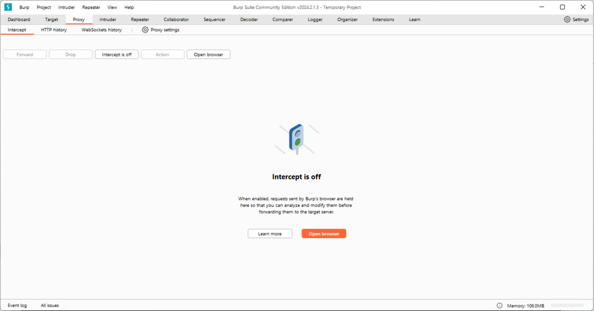
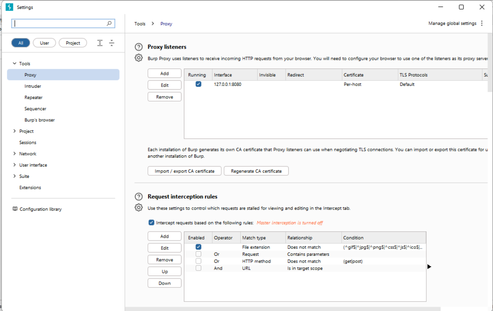
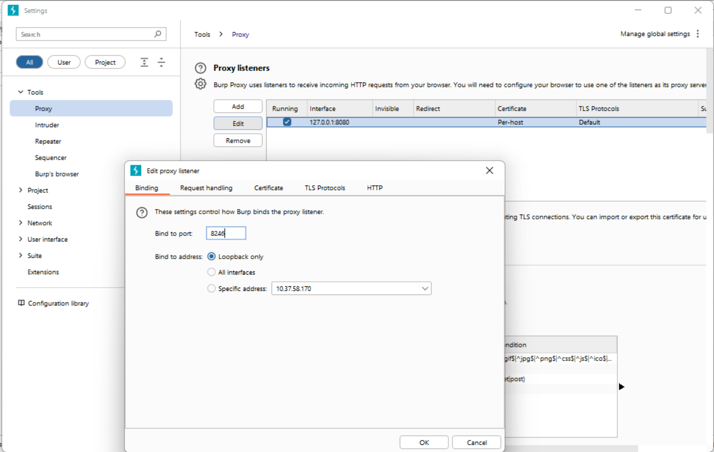

# Change Burpsuite Proxy Listener Port 

To use Burpsuite with our project you will need to change the default port which
Burpsuite interceptor runs on. You will need to perform this action each time you open Burpsuite as 
a temporary project in memory.

### First: Go to Proxy
Go to the Proxy tab in Burpsuite.

Figure 1

### Next: Click on Proxy settings
You should see the following pop-up screen.

Figure 2

### Now: Click on the Field with Your IP and Click Edit
The following pop-up should display. From here you can change the Burpsuite Interceptor listening port to a random unprotected port. If the Interceptor still does not work, try another port.

Figure 3
