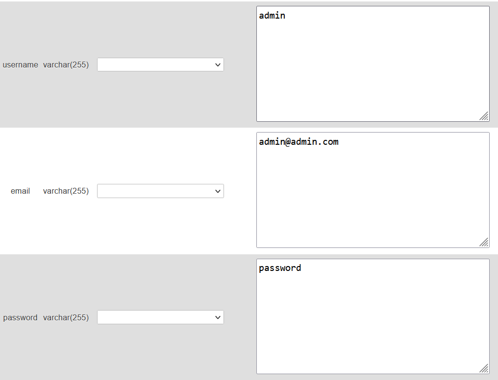
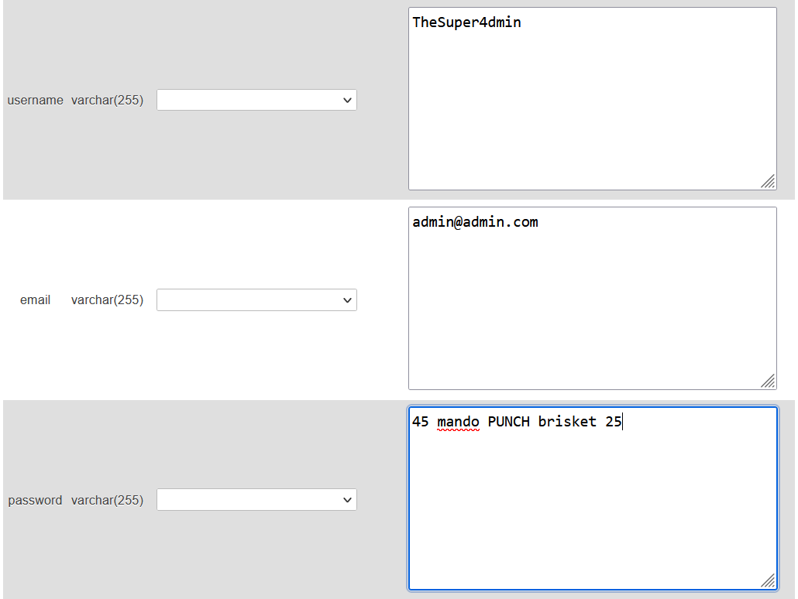
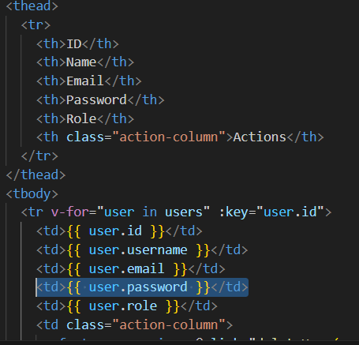
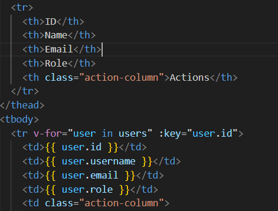
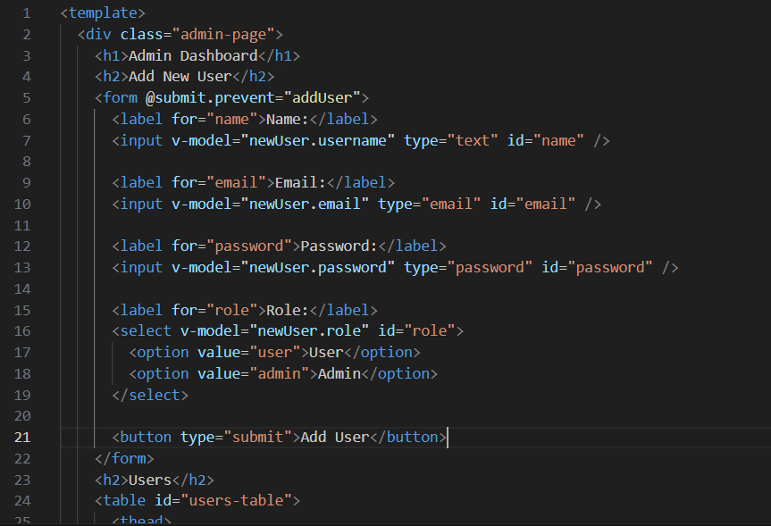
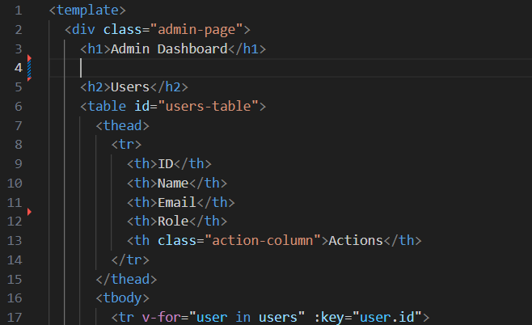
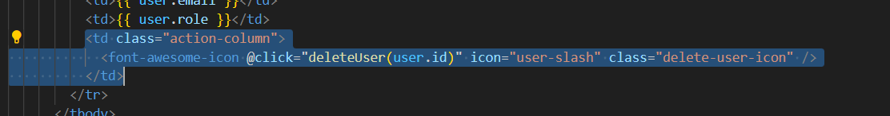

# Vulnerability Remediation Write-Up

**Author**: Neal Bartolomei 
**Date**: 12/11/24

---

## Vulnerability Details

#### Weak Authentication

- **Initial Vulnerability**:
The application's login page had weak administrator credentials, making it susceptible to brute force attacks. The use of a simple username and password allowed attackers to gain unauthorized access with minimal effort. Strengthening these credentials significantly reduces the risk of brute-forcing.

**Original Weak Credentials**:

**Updated Secure Credentials**:

**Remediation**: 
By implementing complex and unique administrator credentials, the application becomes more resistant to brute force attempts, thereby enhancing security for both the administrator account and other users.

---

#### Exposure of Sensitive Information

- **Initial Vulnerability**:
After gaining access via weak admin credentials, an attacker could view sensitive user information, including user IDs and passwords, directly on the admin page. Displaying such data increases the risk of exploitation.

**Old Code**:

**New Code**:

**Remediation**: 
By removing the passwords column from the admin panel, attackers are prevented from easily viewing account passwords. This forces attackers to delve into the database, adding a layer of difficulty to potential exploits.

---

#### Misconfigured Administrative Privileges

- **Initial Vulnerability**: 
The application allowed administrators to create new admin accounts and delete existing accounts directly from the admin page. This lack of restrictions made it easy for attackers to manipulate user roles and remove legitimate administrators.

**Old Code**:

**New Code**:

**Delete Function Removed**

**Remediation**: 
Removing the ability to create or delete admin accounts from the admin page improves the integrity of the system. Any changes to user roles or privileges should be handled directly within the database, ensuring tighter control over administrative actions.

---

**Conclusion**:
This analysis uncovered critical vulnerabilities in the application's authentication mechanisms, data handling, and administrative functionality. By addressing these issues, the security of the application has been significantly improved. Adopting strong password policies, limiting access to sensitive data, and restricting administrative actions are essential steps to reduce the risk of unauthorized access and exploitation. Regular security reviews and adherence to best practices will further fortify the application's defenses.

---
